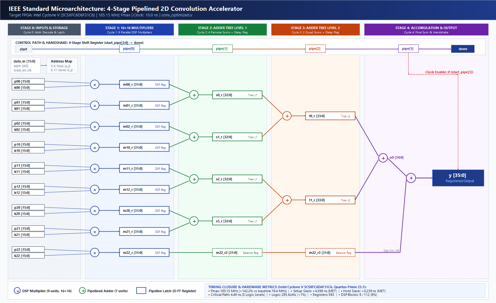
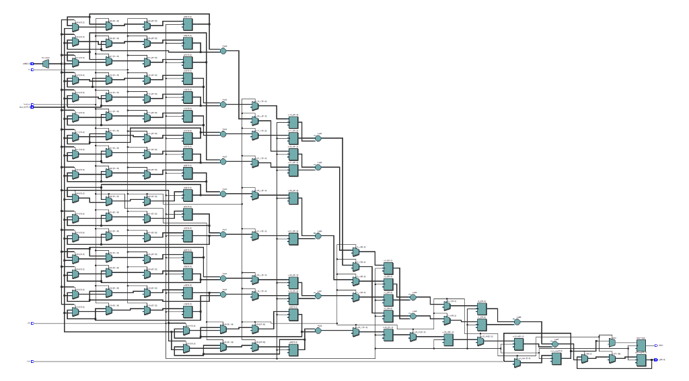
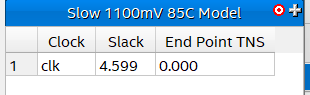
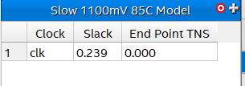

# Optimized Version 1: 4-Stage Pipelined Convolution Engine

This directory contains the complete source code, testbenches, simulation models, Quartus project files, and verified reports for **Optimization V1 (4-Stage Pipelining)** of the 2D $3 \times 3$ Convolution Accelerator on an Intel Cyclone V FPGA (`5CSXFC6D6F31C6`).

---

## 1. Architectural Improvements

In the baseline unpipelined implementation, the full multiply-accumulate operation (9 parallel $16 \times 16$ multiplications followed by an 8-input addition tree) was executed in a single cycle. This created a long combinational path of **$12.475\text{ ns}$**, limiting operating frequency to $76.44\text{ MHz}$ and violating the $100\text{ MHz}$ timing constraint with a setup slack of $-3.083\text{ ns}$.

The V1 optimization introduces a **4-stage balanced pipeline**:

```
Clock Cycle 0: [Input Buffers] p11..p33, k11..k33 latched
                     │
Stage 1 (Cycle 1):  ▼ [Multiplier Registers]  m11_r..m33_r <= p_ij * k_ij  (9 DSP 16x16 mults)
                     │
Stage 2 (Cycle 2):  ▼ [Adder Level 1 Registers] s1_r..s4_r <= 4 parallel pairwise additions
                     │
Stage 3 (Cycle 3):  ▼ [Adder Level 2 Registers] t1_r, t2_r <= 2 parallel intermediate sums
                     │
Stage 4 (Cycle 4):  ▼ [Output Accumulator Reg] y <= t1_r + t2_r + m33_r3, done <= 1'b1
```

### IEEE Standard Microarchitecture Diagram


### RTL Technology Map Schematic


---

## 2. Timing Closure & Performance Results

Synthesized and placed/routed in **Intel Quartus Prime Lite 23.1**:

* **Target Device**: Intel Cyclone V `5CSXFC6D6F31C6`
* **Clock Constraint**: $100.00\text{ MHz}$ ($10.000\text{ ns}$ period)
* **Achieved $F_{max}$**: **$185.15\text{ MHz}$** (**+142.2% speedup** over $76.44\text{ MHz}$ baseline)
* **Setup Slack**: **$+4.599\text{ ns}$ (MET)** (converted $-3.083\text{ ns}$ violation into $+4.599\text{ ns}$ positive margin)
* **Hold Slack**: **$+0.239\text{ ns}$ (MET)**
* **Combinational Path Delay**: **$4.490\text{ ns}$** (**-64.0% delay reduction**)
* **Logic Levels on Critical Path**: **0 levels** (down from 4 levels in baseline)

### Official Quartus Timing Analyzer Screenshots

#### Maximum Operating Frequency ($F_{max} = 185.15\text{ MHz}$)


#### Setup Slack Summary ($+4.599\text{ ns}$)


#### Hold Slack Summary ($+0.239\text{ ns}$)


---

## 3. Vector-Based Power Analysis (via Testbench VCD)

Unlike standard vectorless power estimation which assumes a default 12.5% toggle probability, the power dissipation for this optimized design was calculated by feeding **actual simulation toggle transitions** from the testbench execution into the Quartus Prime Power Analyzer.

* **Simulation Tool**: ModelSim - Intel FPGA Edition 20.1
* **Input Activity File**: [`conv_optimized_5tests.vcd`](simulation/conv_optimized_5tests.vcd)
* **Internal Node Toggle Coverage**: **75.3%** of design nodes actively toggled
* **Average Toggle Rate**: 5.815 million transitions / sec

| Metric | Value | Notes |
| :--- | :---: | :--- |
| **Total Thermal Power** | **432.85 mW** | **-19.29 mW lower total power than baseline** |
| **Core Static Power** | **411.30 mW** | Cyclone V transistor sub-threshold leakage |
| **Core Dynamic Power** | **9.02 mW** | Vector-based dynamic switching activity |
| **I/O Thermal Power** | **12.53 mW** | Board & pin interface dissipation |


---

## 4. Testbench Verification & Simulation

The testbench [`simulation/tb_conv_optimized.v`](simulation/tb_conv_optimized.v) verifies 5 standard image processing kernels and dumps switching data to [`simulation/conv_optimized_5tests.vcd`](simulation/conv_optimized_5tests.vcd):

1. **Identity Filter**: Output = 50 (PASS)
2. **Blur Filter**: Output = 450 (PASS)
3. **Edge Detection**: Output = 0 (PASS)
4. **Sharpening Filter**: Output = 50 (PASS)
5. **Emboss Filter**: Output = 290 (PASS)

* **Errors**: **0** (100% functional match)
* **Latency**: Exactly 4 clock cycles between `start` assertion and `done` assertion.

### Waveform Simulation


### ModelSim Console Transcript


---

## 5. How to Re-Run Simulation & Synthesis

### Running ModelSim Simulation & Generating VCD
```powershell
cd 02_optimized_v1_pipelining\simulation
vlib work
vlog -work work ..\rtl\conv_optimized.v tb_conv_optimized.v
vsim -c -do "run -all; quit -f" work.tb_conv_optimized
```

### Opening ModelSim GUI with Color-Coded Waveforms
```powershell
vsim -do view_wave.do
```

### Running Quartus Synthesis & Vector-Based Power Analysis
```powershell
cd 02_optimized_v1_pipelining\quartus
quartus_map conv_optimized
quartus_fit conv_optimized
quartus_sta conv_optimized
quartus_pow conv_optimized
```
