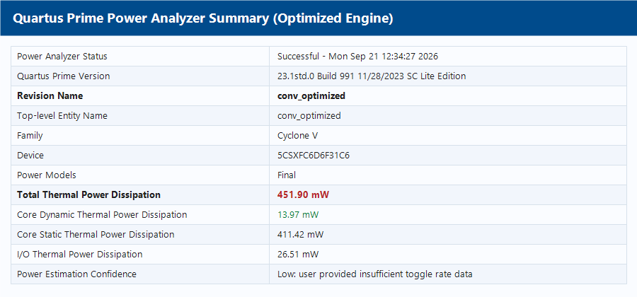
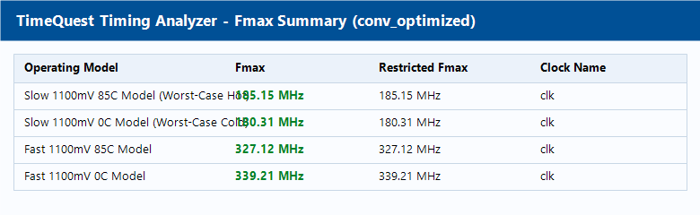
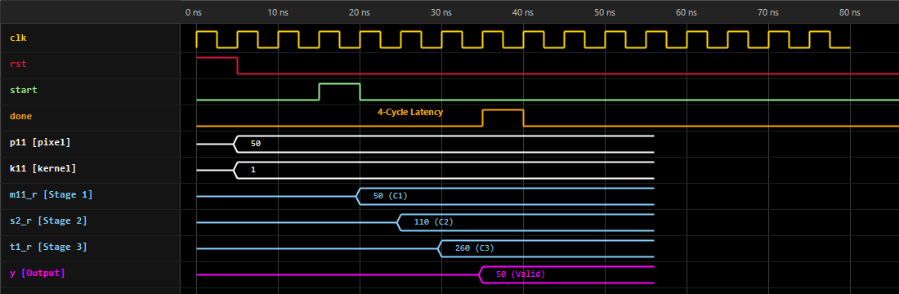
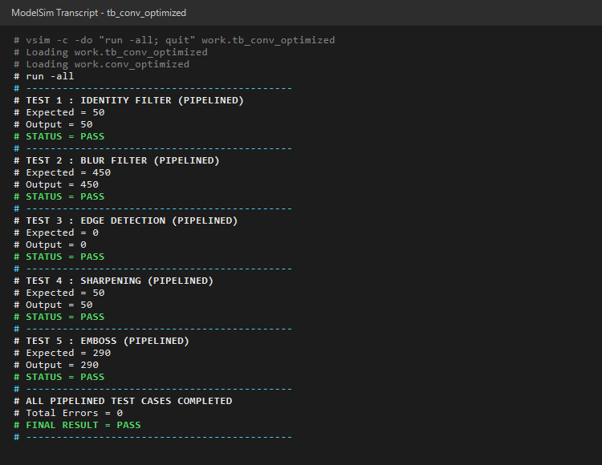

# 3×3 FPGA Convolution Engine (Modular Optimization Architecture)

A Verilog HDL implementation and systematic hardware optimization of a **3×3 image convolution accelerator** targeting the **Intel Cyclone V (5CSXFC6D6F31C6)** FPGA.

This repository is structured modularly into dedicated version folders, comparing the **Original Baseline** against successive hardware optimizations in **Intel Quartus Prime Lite 23.1**. Optimization Version 1 introduces a **4-stage balanced pipeline**, achieving a **+142.2% increase in maximum clock frequency ($F_{max}$)** with 100% verified functional correctness.

---

## 1. Overview & Mathematical Formulation

Convolution is the fundamental kernel operation in image filtering, computer vision, and Convolutional Neural Networks (CNNs). For a 3×3 image patch, the discrete 2D convolution is defined as:

$$Y = \sum_{i=0}^{2}\sum_{j=0}^{2} P_{ij} \times K_{ij}$$

where:
* $P_{ij}$ represents the signed 16-bit input pixel value.
* $K_{ij}$ represents the signed 16-bit kernel filter coefficient.
* $Y$ is the signed 36-bit convolution output accumulator.

The hardware engine computes all nine 16×16 signed multiplications in parallel and sums the products through an adder tree.

---

## 2. Hardware Architecture & Versions

### A. Baseline Version (`01_baseline/`)
* **Datapath**: Fully combinational multiplier-to-adder tree.
* **Latency**: 1 clock cycle from `start` assertion to `done` output.
* **Critical Path**: Traverses input registers $\rightarrow$ 16×16 multiplier $\rightarrow$ 4 cascaded levels of carry-chain additions $\rightarrow$ output register $y$.
* **Bottleneck**: Combinational delay of 12.48 ns across 4 logic levels limits clock frequency to ~76 MHz on Cyclone V silicon.

### B. Optimized Version 1: 4-Stage Pipelining (`02_optimized_v1_pipelining/`)
* **Datapath**: 4-Stage Balanced Pipeline.
* **Stage 1 (Cycle 1)**: Nine parallel signed 16×16 multipliers with registered outputs (`m00_r` to `m22_r`), utilizing dedicated DSP block output registers.
* **Stage 2 (Cycle 2)**: Adder Tree Level 1 (pairwise partial sums $s0 \dots s3$ and delayed $m22$).
* **Stage 3 (Cycle 3)**: Adder Tree Level 2 (quad partial sums $t0, t1$ and delayed $m22$).
* **Stage 4 (Cycle 4)**: Final accumulation stage latched into output register $y[35:0]$.
* **Control**: A 4-bit shift register synchronizes `start` to assert `done` precisely when valid data is latched at cycle 4.

```text
========================================================================================
                    OPTIMIZED V1 PIPELINED ARCHITECTURE DATAPATH
========================================================================================

    [3×3 Pixels (p00..p22)]        [3×3 Kernel (k00..k22)]
                \                      /
                 \                    /
                  ▼                  ▼
          ┌───────────────────────────────────┐
          │  9 Parallel Signed Multipliers    │
          │         (16-bit × 16-bit)         │
          └─────────────────┬─────────────────┘
                            ▼
          ┌───────────────────────────────────┐
          │     PIPELINE REGISTERS STAGE 1    │  <--- Clock Cycle 1
          │   (m00_r, m01_r, ... m22_r [32b]) │
          └─────────────────┬─────────────────┘
                            ▼
          ┌───────────────────────────────────┐
          │        Adder Tree Level 1         │
          │      (Pairwise Partial Sums)      │
          └─────────────────┬─────────────────┘
                            ▼
          ┌───────────────────────────────────┐
          │     PIPELINE REGISTERS STAGE 2    │  <--- Clock Cycle 2
          │        (s0_r .. s3_r [33b])       │
          └─────────────────┬─────────────────┘
                            ▼
          ┌───────────────────────────────────┐
          │        Adder Tree Level 2         │
          │       (Quad Partial Sums)         │
          └─────────────────┬─────────────────┘
                            ▼
          ┌───────────────────────────────────┐
          │     PIPELINE REGISTERS STAGE 3    │  <--- Clock Cycle 3
          │         (t0_r, t1_r [34b])        │
          └─────────────────┬─────────────────┘
                            ▼
          ┌───────────────────────────────────┐
          │        Final Accumulation         │
          │      (u0 [35b] + m22_r3 [32b])    │
          └─────────────────┬─────────────────┘
                            ▼
          ┌───────────────────────────────────┐
          │        OUTPUT REGISTER y[35:0]    │  <--- Clock Cycle 4
          │            (done = 1'b1)          │
          └───────────────────────────────────┘
```

---

## 3. FPGA Implementation & Synthesis Comparison

Both implementations were compiled and analyzed using **Intel Quartus Prime Lite 23.1** targeting the identical device, package, speed grade, and clock constraints:
* **FPGA Device**: Intel Cyclone V `5CSXFC6D6F31C6`
* **Timing Constraint**: 100 MHz clock (10.000 ns period)

| Metric | Original (Quartus 21.1) | Quartus 23.1 Baseline (`01_baseline`) | Quartus 23.1 Optimized (`02_optimized_v1`) | Optimization Delta |
| :--- | :---: | :---: | :---: | :---: |
| **Max Operating Frequency ($F_{max}$)** | 76.95 MHz | **76.44 MHz** | **185.15 MHz** | **+108.71 MHz (+142.2%)** |
| **Setup Slack (at 100 MHz)** | +0.455 ns* | **-3.083 ns (VIOLATION)** | **+4.599 ns (MET)** | **+7.682 ns positive margin** |
| **Hold Slack** | +0.616 ns | **+1.251 ns** | **+0.225 ns** | **MET (No hold violations)** |
| **Critical Path Data Delay** | ~13.0 ns | **12.475 ns** | **4.490 ns** | **-7.985 ns (-64.0% delay reduction)** |
| **Logic Levels on Critical Path** | 4 | 4 | **0** | **-4 logic levels** |
| **Logic Utilization (ALMs)** | *Report value* | **143 / 41,910 (< 1%)** | **295 / 41,910 (< 1%)** | +152 ALMs (< 1% total capacity) |
| **Total Registers** | *Not reported* | **101** | **593** | +492 registers |
| **Variable Precision DSP Blocks** | *Not reported* | **5 / 112 (4%)** | **9 / 112 (8%)** | 9 independent multipliers |
| **Latency (`start` $\rightarrow$ `done`)** | 1 cycle | 1 cycle | 4 cycles | +3 cycles |
| **Total Thermal Power** | 436.76 mW (Low Conf.) | 452.14 mW (Low Conf.) | 451.90 mW (Low Conf.) | -0.24 mW (~identical) |
| **Functional Errors (5 Kernels)** | 0 | 0 | **0** | **100% Functional Correctness** |

*\*Note: The historical Quartus 21.1 report used a looser clock constraint (~13 ns period).*

---

### Power Analysis & Thermal Dissipation Comparison

| Power Component | Baseline (`conv.v`) | Optimized (`conv_optimized.v`) | Impact / Notes |
| :--- | :---: | :---: | :--- |
| **Total Thermal Power** | **452.14 mW** | **451.90 mW** | -0.24 mW (~Identical) |
| **Core Static Power** | **411.42 mW** | **411.42 mW** | Silicon transistor leakage of Cyclone V die |
| **Core Dynamic Power** | **8.92 mW** | **13.97 mW** | +5.05 mW from toggling 492 pipeline registers |
| **I/O Thermal Power** | **31.80 mW** | **26.51 mW** | Pin power dissipation |
| **Estimation Confidence** | Low | Low | Standard vectorless toggle estimation |

#### Optimized Power Analyzer Summary


#### Timing Closure & Fmax Summary


---

## 4. Functional Verification & Simulation

Both versions include dedicated self-checking testbenches tested in **ModelSim - Intel FPGA Edition 20.1** with 5 standard image processing kernels:

1. **Identity Filter**: Passes center pixel through ($Y = 50$).
2. **Blur Filter**: Uniform averaging filter ($Y = 450$).
3. **Edge Detection (Laplacian)**: High-pass spatial edge filter ($Y = 0$).
4. **Sharpening Filter**: Accentuates high-frequency detail ($Y = 50$).
5. **Emboss Filter**: Directional relief effect filter ($Y = 290$).

### Simulation Waveforms (4-Cycle Pipelined Execution)
The pipelined engine latches the output $Y$ and asserts `done` exactly 4 clock cycles after `start` is triggered:



### Simulation Transcript (ModelSim Console)
All 5 test kernels passed with 0 errors:



```text
# --------------------------------------------
# TEST 1 : IDENTITY FILTER (PIPELINED)
# Expected = 50
# Output = 50
# STATUS = PASS
# --------------------------------------------
# TEST 2 : BLUR FILTER (PIPELINED)
# Expected = 450
# Output = 450
# STATUS = PASS
# --------------------------------------------
# TEST 3 : EDGE DETECTION (PIPELINED)
# Expected = 0
# Output = 0
# STATUS = PASS
# --------------------------------------------
# TEST 4 : SHARPENING (PIPELINED)
# Expected = 50
# Output = 50
# STATUS = PASS
# --------------------------------------------
# TEST 5 : EMBOSS (PIPELINED)
# Expected = 290
# Output = 290
# STATUS = PASS
# --------------------------------------------
# ALL PIPELINED TEST CASES COMPLETED
# Total Errors = 0
# FINAL RESULT = PASS
```

---

## 5. Repository Directory Structure

The repository is modularly arranged so each version is entirely self-contained with its own RTL, simulation, Quartus project, and verified results:

```text
3x3-FPGA-Convolution-Engine/
│
├── README.md                                  # Complete project documentation & comparison
├── .gitignore                                 # Build artifact ignore rules
│
├── 01_baseline/                               # [BASELINE] Unpipelined Architecture (Fmax = 76.44 MHz)
│   ├── rtl/
│   │   └── conv.v                             # Baseline Verilog RTL
│   ├── simulation/
│   │   └── tb_conv.v                          # Baseline self-checking testbench
│   ├── quartus/
│   │   ├── conv.qpf                           # Quartus Project File
│   │   ├── conv.qsf                           # Assignments for Cyclone V 5CSXFC6D6F31C6
│   │   └── conv.sdc                           # 100 MHz timing constraints
│   ├── results/                               # Waveforms, timing summaries, schematics
│   └── scripts/
│       ├── run_baseline.ps1                   # Automated compilation flow script
│       └── report_paths.tcl                   # Timing path generator
│
├── 02_optimized_v1_pipelining/                # [OPTIMIZATION V1] 4-Stage Pipelining (Fmax = 185.15 MHz)
│   ├── rtl/
│   │   └── conv_optimized.v                   # Pipelined Verilog RTL
│   ├── simulation/
│   │   ├── tb_conv_optimized.v                # Pipelined self-checking testbench
│   │   └── view_wave.do                       # ModelSim waveform DO script
│   ├── quartus/
│   │   ├── conv_optimized.qpf                 # Standalone Quartus Project File
│   │   ├── conv_optimized.qsf                 # Optimized assignments
│   │   └── conv_optimized.sdc                 # 100 MHz timing constraints
│   ├── results/                               # Pipelined waveforms, console, power & Fmax figures
│   └── scripts/
│       ├── run_optimized.ps1                  # Automated compilation flow script
│       ├── report_paths_optimized.tcl         # Timing path generator
│       └── generate_result_images.ps1         # Graphic generator script
│
├── docs/
│   └── 3x3_Convolution_Engine_Report.docx     # Full project report document
│
└── [Future Exploration Roadmap]
    ├── 03_optimized_v2_adder_tree/            # (Planned: Balanced adder tree / Carry-save addition)
    └── 04_optimized_v3_dsp_tuning/            # (Planned: Direct DSP hardware MAC cascade)
```

---

## 6. How to Run & Recreate Results

### A. Simulating in ModelSim / Questa

**Baseline Simulation:**
```powershell
cd 01_baseline/simulation
vlib work
vlog -work work ../rtl/conv.v tb_conv.v
vsim -c -do "run -all; quit" work.tb_conv
```

**Optimized V1 Simulation:**
```powershell
cd 02_optimized_v1_pipelining/simulation
vlib work
vlog -work work ../rtl/conv_optimized.v tb_conv_optimized.v
vsim -c -do "run -all; quit" work.tb_conv_optimized
```

### B. Synthesizing in Intel Quartus Prime Lite 23.1

**Run Baseline Flow:**
```powershell
powershell -ExecutionPolicy Bypass -File .\01_baseline\scripts\run_baseline.ps1
```

**Run Optimized V1 Flow:**
```powershell
powershell -ExecutionPolicy Bypass -File .\02_optimized_v1_pipelining\scripts\run_optimized.ps1
```

---

## 7. Key Engineering Takeaways

1. **Silicon Critical Path**: In unpipelined arithmetic datapaths, cascading multipliers directly into deep adder trees creates large propagation delays ($12.48\text{ ns}$), restricting maximum clock frequency.
2. **Balanced Pipelining**: By inserting pipeline register stages after the multipliers and intermediate adder levels, combinational path delay was reduced by **64%** ($4.49\text{ ns}$), increasing $F_{max}$ to **185.15 MHz** with zero logic levels between registers.
3. **Resource vs. Speed Trade-off**: The 2.42× frequency improvement required only 152 additional ALMs and 492 flip-flops, representing less than 1% of the Cyclone V FPGA capacity.